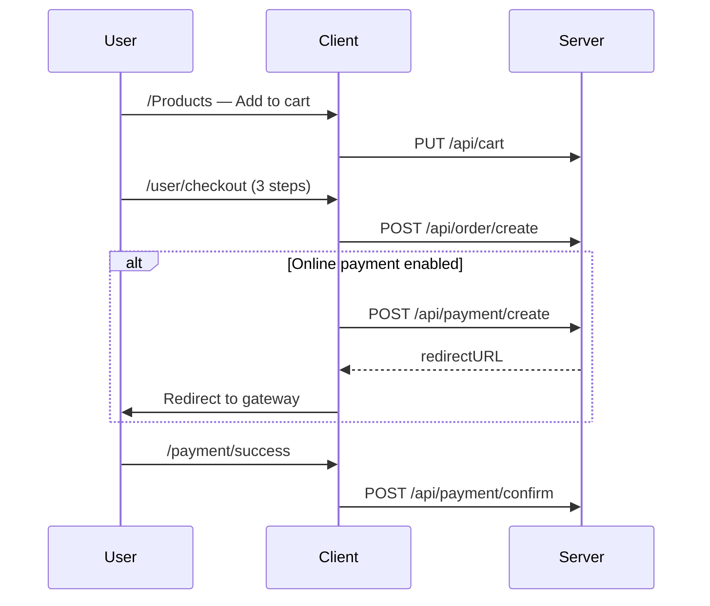

# scanzybd-client

React 19 SPA for ScanzyBD — Vite 7, Tailwind CSS 4, React Router 7.

**Local default:** http://localhost:5173  
**API:** configured via `VITE_API_BASE_URL` (default `http://localhost:5000`)

---

## Scripts

| Command | Description |
|---------|-------------|
| `npm run dev` | Vite dev server (port 5173, `strictPort: true`) |
| `npm run build` | Production build → `dist/` |
| `npm run preview` | Preview production build |
| `npm run lint` | ESLint |

**No test script** — no automated tests in this package.

---

## Project structure

```
startup-client/src/
├── main.jsx                 # Entry — providers, router, AOS, i18n
├── config/
│   ├── api.js               # API_BASE_URL from VITE_API_BASE_URL
│   ├── company.js           # Branding from VITE_* env
│   └── featuredProduct.js   # FEATURED_PRODUCT_ID
├── contexts/
│   ├── AuthContext/         # Login, JWT, Google social
│   ├── CartContext/         # Server-backed cart
│   └── ThemeContext/        # Light/dark theme
├── hooks/                   # useAuth, useCart, useAxiosSecure, …
├── router/
│   ├── router.jsx           # All routes + guards
│   ├── routeChunks.js       # Lazy import loaders + prefetch list
│   ├── lazyRoute.jsx        # Suspense wrappers
│   └── RoutePrefetch.jsx    # Idle prefetch all chunks
├── routes/                  # PrivateRoute, AdminRoute, ProviderRoute
├── layouts/                 # Root, Auth, User, Dashboard
├── pages/
│   ├── Home/                # Marketing, products, OfferShowcase, QrLanding
│   ├── User/                # Cart, checkout, orders, vehicles, …
│   ├── Dashboard/           # Admin/provider tools
│   └── Authentication/      # Login, register, forgot password
├── components/              # Shared UI (package/, payment/, settings/, …)
├── lib/                     # PDF, QR, form utils, uiClasses
├── locales/                 # en.json, bn.json
├── firebase/                # firebase.init.js
└── utils/                   # appJwtStorage.js
```

**Unused files:** `src/App.jsx`, `src/App.css` (not imported).  
**Orphan pages:** `Dashboard/Vehicle/AddVehiclePage.jsx`; legacy order pages (`AllOrders.jsx`, etc.) — routes redirect to `StaffOrdersPage`.

---

## Environment variables

Copy `.env example` to `.env`. Restart dev server after changes.

### Required for full functionality

| Variable | Purpose |
|----------|---------|
| `VITE_API_BASE_URL` | Backend origin, no trailing slash (`config/api.js`) |

### Firebase (Google login)

| Variable | Purpose |
|----------|---------|
| `VITE_apiKey` | Firebase config |
| `VITE_authDomain` | |
| `VITE_projectId` | |
| `VITE_storageBucket` | |
| `VITE_messagingSenderId` | |
| `VITE_appId` | |

### Branding (`config/company.js`)

| Variable | Default if unset |
|----------|------------------|
| `VITE_COMPANY_NAME` | QR Tag |
| `VITE_PRODUCT_NAME` | QR Tag |
| `VITE_BRAND_FULL` | QR Tag System |
| `VITE_SITE_TITLE` | QR Tag \| Smart Vehicle Safety… |
| `VITE_COMPANY_LEGAL_NAME` | QR Tag System |
| `VITE_COMPANY_TAGLINE` | Scan. Connect. Stay Safe. |
| `VITE_COMPANY_ORG_TITLE` | Same as company name |
| `VITE_COMPANY_PRINT_ORG_LINE` | QR Tag |
| `VITE_COMPANY_FOOTER_TAGLINE` | Smart Safety for Every Vehicle |

### Used in code but not in `.env example`

| Variable | Purpose |
|----------|---------|
| `VITE_LOGO_TEXT_COLOR` | Header wordmark color |
| `VITE_BRAND_YELLOW` | Banner yellow (`#FFD700`) |
| `VITE_BANNER_VIDEO_URL` | Homepage banner video (Cloudinary CDN URL) |
| `VITE_FEATURED_PRODUCT_ID` | Home spotlight product (`featuredProduct.js`) |

**Vite rule:** use static `import.meta.env.VITE_*` references — dynamic lookup is not replaced at build time.

---

## App bootstrap (`main.jsx`)

Provider order (outer → inner):

1. `ThemeProvider`
2. `PersistQueryClientProvider` (React Query → `localStorage` key `qr-tag-react-query`)
3. `GlobalFetchingBar`
4. `CartProvider`
5. `AuthProvider`
6. `RoutePrefetch`
7. `RouterProvider`

Also loads: i18n, AOS animations, global CSS, `document.title` from `SITE_TITLE`.

---

## Routing

**Router:** `createBrowserRouter` in `router/router.jsx`  
**Lazy loading:** all pages via `routeChunks.js`

### Route guards

| Guard | File | Rule |
|-------|------|------|
| `PrivateRoute` | `routes/PrivetRoute.jsx` | Requires login; optional `allowedRoles` |
| `AdminRoute` | `routes/AdminRoute.jsx` | `userRole === "admin"` |
| `ProviderRoute` | `routes/ProviderRoute.jsx` | `userRole === "provider"` |

### Public (`RootLayout`)

| Path | Page |
|------|------|
| `/` | Home |
| `/about`, `/contact` | About, Contact |
| `/Products`, `/Products/:id`, `/product` | Product catalog |
| `/qr-landing/:code` | Public QR scan landing |
| `/terms-of-use`, `/privacy-policy`, `/faq`, … | `FooterStaticPage` |

### Auth (`AuthLayout`)

`/login`, `/register`, `/forgotPassword/*`  
`/payment/success`, `/payment/failed` — require login

### User area (`/user` — `PrivateRoute`)

| Path | Page |
|------|------|
| `/user/my-cart` | Cart |
| `/user/checkout` | Checkout wizard |
| `/user/user-orders`, `/user/my-orders` | Order history |
| `/user/my-purchases` | Subscriptions / renew |
| `/user/my-vehiclePage` | My vehicles |
| `/user/payment` | Payment history |
| `/user/user-profile`, `/user/user-settings` | Profile, settings |

### Dashboard (`/dashboard` — admin or provider)

| Path | Page | Extra guard |
|------|------|-------------|
| `/dashboard` | Dashboard home | — |
| `/dashboard/orders` | Staff orders | — |
| `/dashboard/create-order` | Staff checkout | — |
| `/dashboard/all-products` | Product list | — |
| `/dashboard/add-product` | Add product | Admin |
| `/dashboard/all-packages`, `/add-package` | Packages | Add = Admin |
| `/dashboard/all-qr`, `/generate-qr` | QR management | — |
| `/dashboard/finance-management` | Admin finance | Admin |
| `/dashboard/provider-finance` | Provider finance | Provider |
| `/dashboard/unpaid-orders` | Unpaid orders | Admin |
| `/dashboard/confirmed-orders` | Confirmed orders | Admin |
| `/dashboard/user-management` | Users | Admin |

Several legacy paths redirect to `/dashboard/orders` or `/dashboard/confirmed-orders` — see `router.jsx`.

---

## State management

### Auth (`AuthProvider`)

- Email/password: `POST /api/auth/login` → JWT in `localStorage` (`appJwtStorage.js`)
- Google: Firebase `signInWithPopup` → `POST /api/auth/social`
- Session restore: `GET /api/auth/me` on load
- Logout: clears JWT, cart view, React Query cache, Firebase sign-out
- Post-login: admin/provider → `/dashboard`; others → previous page or `/`

### Cart (`CartProvider`)

- **Server-backed** — `GET/PUT/DELETE /api/cart`
- Legacy `localStorage` cart keys removed on mount
- `addToCart` requires login; returns `false` if guest or inactive product
- Empty cart uses `DELETE /api/cart` (not PUT with empty array failure)
- Reloaded on login and session restore

### Server data (React Query)

- Used in payment history, gateways, tag types, finance, etc.
- Persisted 24h via `@tanstack/react-query-persist-client`

---

## Key user flows

### Browse → cart → checkout



**Checkout file:** `pages/Dashboard/Order/Checkout.jsx` (routed under `/user/checkout`)

Steps: Order review → Shipping address → Vehicle/tag assignments  
APIs: `/api/locations`, `/api/locations/brta-zones`, `/api/locations/brta-series`, `useTagTypes`, `usePaymentGateways`

### Homepage offers

- Admin: `/dashboard/add-package` with **Live Preview** (`PackageOfferPreview`)
- Public: `OfferShowcase` on Home — `GET /api/package`

### QR scan (public)

- URL: `/qr-landing/:code`
- Fetches QR/vehicle data from API
- Hides contact if subscription expired (`subscriptionExpired` in scan response)

---

## HTTP clients

| Hook | Auth | Use |
|------|------|-----|
| `useAxios` | None | Public GET (products, reviews, packages) |
| `useAxiosSecure` | Bearer JWT | All protected API calls |

Base URL: `config/api.js` → `VITE_API_BASE_URL`

---

## Styling & UI

- **Tailwind CSS 4** via `@tailwindcss/vite`
- **DaisyUI** — `btn`, `card`, `badge`, etc.
- Shared snippets: `lib/uiClasses.js` (`cardSurface`, `btnPrimary`, `fieldInput`, …)
- **Dark mode:** `ThemeContext` — `data-theme` + `dark` class, key `app-theme`
- **i18n:** English + Bengali — `locales/en.json`, `bn.json`; key `appLanguage`

---

## Build & deploy

```bash
npm run build
# Deploy dist/ to static host (Vercel, Netlify, etc.)
```

Set `VITE_API_BASE_URL` to production API **at build time** (Vite embeds env vars).

`vite.config.js`:

- Port 5173, `host: true`, `strictPort: true`
- Plugins: `@vitejs/plugin-react`, `@tailwindcss/vite`

---

## Adding a page

1. Create component in `src/pages/<area>/`
2. Add export loader to `router/routeChunks.js`
3. Optionally add to `allRouteChunkLoaders` for idle prefetch
4. Register route in `router/router.jsx` with correct layout + guard
5. Add nav link in `DashboardLayout.jsx` or `Navbar.jsx`
6. Add strings to `locales/en.json` and `bn.json`

---

## Package form (dashboard)

| File | Role |
|------|------|
| `pages/Dashboard/Package/AddPackages.jsx` | Create + live preview |
| `pages/Dashboard/Package/AllPackages.jsx` | List, edit modal, delete |
| `components/package/PackageFormFields.jsx` | Shared form |
| `components/package/PackageOfferPreview.jsx` | Homepage card preview |
| `components/package/EditPackageModal.jsx` | Edit in modal |
| `lib/packageFormUtils.js` | Validation, payload builder |

---

## Dependencies note

**Used heavily:** react, react-router, @tanstack/react-query, axios, firebase, i18next, lucide-react, sweetalert2, jspdf, qrcode, html5-qrcode, xlsx, aos

**In package.json but no imports found in `src/`:** `leaflet`, `react-leaflet`, `swiper`, `react-fast-marquee`, `react-responsive-carousel`, `qrcode.react` — candidates for removal after verification.

---

## Troubleshooting

| Issue | Check |
|-------|--------|
| API calls wrong host | `VITE_API_BASE_URL`; rebuild after env change |
| 401 on all requests | JWT expired (24h); login again |
| Cart not updating | Network tab on `PUT /api/cart`; must be logged in |
| Google login fails | Firebase env vars; server `FIREBASE_WEB_API_KEY` |
| Blank page after deploy | Base path / SPA fallback on static host |
| Branding not updating | Static `import.meta.env.VITE_*` in `company.js`; restart dev server |

---

See also: [../README.md](../README.md) (monorepo overview), [../startup-server/README.md](../startup-server/README.md) (API reference).
